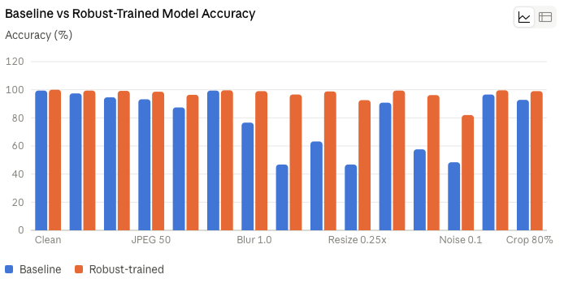
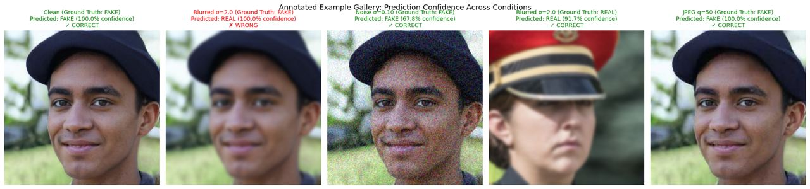
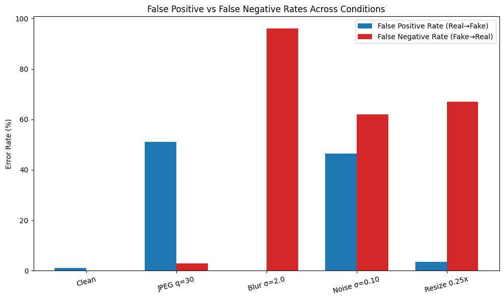
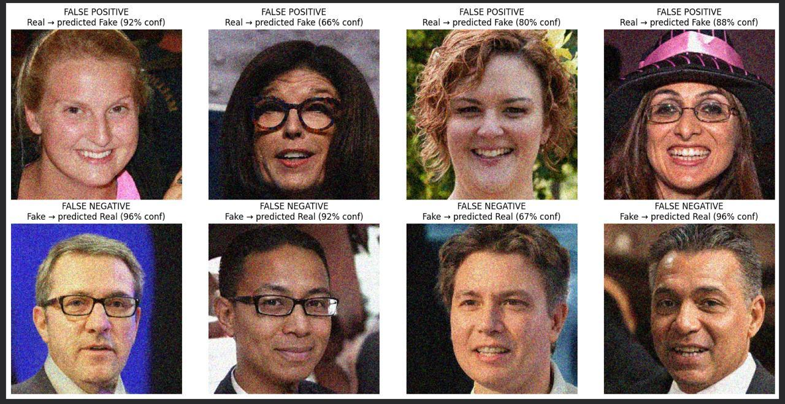

# ProfileGuard: Robust AI-Generated Face Detection

ProfileGuard is a lightweight AI-image detector purpose-built to catch AI-generated profile pictures used in catfishing and romance scams on dating apps and social platforms. Unlike detectors that only work on clean, high-resolution images straight from a generator, ProfileGuard is trained and evaluated specifically for real-world conditions: photos that have been resized into thumbnails, JPEG-compressed on upload, blurred, cropped, or lightly filtered — exactly what happens to every profile picture on a real platform.

## Project Overview

Generative AI has made it trivial to create realistic fake human faces at scale, powering large-scale catfishing and romance scams. Most detection approaches are evaluated only on pristine images, which don't reflect how photos actually move through real platforms. ProfileGuard closes that gap: we specifically train and test against the transformations a profile picture undergoes in the wild (compression, blur, resizing, noise, color adjustment, cropping), and quantify how much robustness training improves survival under each one.

**Our approach in one sentence:** fine-tune a small pretrained EfficientNet-B0 classifier on real vs. AI-generated faces, then further fine-tune it with randomized real-world image corruptions applied during training, so the model learns robust features instead of fragile pixel-level artifacts that vanish under compression or blur.

## Development Tools & Environment

- **Environment:** Google Colab (free tier, T4 GPU for training, CPU for inference)
- **Language:** Python 3
- **Key libraries:** PyTorch, `timm` (pretrained model library), `torchvision`, OpenCV (`opencv-python-headless`), Pillow, NumPy, Matplotlib

## Model

- **Architecture:** EfficientNet-B0 (pretrained on ImageNet), fine-tuned for binary classification (real vs. AI-generated)
- **Parameters:** ~5.3M (well under the 2B parameter limit)
- **Training approach:** Transfer learning — early layers frozen, final blocks and classifier head fine-tuned, first on clean data then further fine-tuned with randomized robustness augmentations (JPEG compression, Gaussian blur, downscale/upscale, Gaussian noise, color jitter, center crop) applied per-image during training.

## Datasets

- **[140k Real and Fake Faces](https://www.kaggle.com/datasets/xhlulu/140k-real-and-fake-faces)** (Kaggle) — 70k real human faces + 70k StyleGAN-generated faces. Used for training, validation, and testing. Chosen over the officially suggested datasets because it's specifically faces, matching our dating-app-profile-picture use case, rather than general AI-generated imagery.
- Robustness test conditions were self-generated by applying the exact transform parameters specified in the challenge brief (JPEG quality 90/70/50/30, Gaussian blur σ=0.5/1.0/2.0, resize 0.5×/0.25×, Gaussian noise σ=0.02/0.05/0.10, color jitter ±20%, center crop 80%) to held-out test images.

---

## Robustness Evaluation Summary

We evaluated both a clean-trained baseline model and our robustness-trained model across every transform condition specified in the challenge brief, on a held-out 500-image test sample.

| Condition | Baseline Accuracy | Robust-Trained Accuracy | Improvement |
|---|---|---|---|
| Clean (no transform) | 99.4% | 100.0% | +0.6 |
| JPEG q=90 | 97.4% | 99.4% | +2.0 |
| JPEG q=70 | 94.6% | 99.2% | +4.6 |
| JPEG q=50 | 93.2% | 98.6% | +5.4 |
| JPEG q=30 | 87.4% | 96.4% | +9.0 |
| Blur σ=0.5 | 99.4% | 99.6% | +0.2 |
| Blur σ=1.0 | 76.6% | 99.0% | +22.4 |
| Blur σ=2.0 | 46.8% | 96.6% | +49.8 |
| Resize 0.5× | 63.2% | 98.8% | +35.6 |
| Resize 0.25× | 46.8% | 92.6% | +45.8 |
| Noise σ=0.02 | 90.8% | 99.4% | +8.6 |
| Noise σ=0.05 | 57.6% | 96.2% | +38.6 |
| Noise σ=0.10 | 48.4% | 82.0% | +33.6 |
| Color jitter ±20% | 96.6% | 99.6% | +3.0 |
| Center crop 80% | 92.8% | 99.0% | +6.2 |



Robustness training recovered up to **+49.8 percentage points** on the conditions where the baseline model failed most severely (heavy blur, aggressive downscaling, strong noise), while *also* slightly improving clean-image accuracy — showing that robustness training didn't come at the cost of clean performance.



*Example: the same fake image correctly identified as AI-generated when clean or lightly compressed, but misclassified under heavy blur and noise — illustrating exactly the failure mode robustness training targets.*

---

## Error Analysis Note

**Error type breakdown by condition (baseline model):**



This breakdown reveals that error *type* isn't uniform across conditions. Under heavy blur (σ=2.0), the baseline model's errors were overwhelmingly false negatives — AI-generated faces misclassified as real, with a false negative rate around 96%, versus a near-zero false positive rate. This means blur specifically causes the model to miss fakes rather than over-flag real photos, which is the more dangerous direction of error for a fraud-detection use case. Under JPEG compression and resizing, errors were more mixed between both types.

**Representative examples:**



*Top row: real photos misclassified as AI-generated (false positives). Bottom row: AI-generated photos misclassified as real (false negatives), several under heavy noise.*

**Written analysis:**

Under our most challenging condition for the robustness-trained model (heavy Gaussian noise, σ=0.10), we observed an asymmetric error pattern: false positives (real photos misclassified as AI-generated) outnumbered false negatives (AI photos misclassified as real) — at least 30 versus 21 out of 500 test images. For a fraud-prevention use case like flagging fake dating-app profiles, this is a favorable trade-off, since it errs toward over-flagging rather than letting fake profiles through undetected; a production system could route flagged-but-uncertain cases to manual review rather than auto-rejecting them.

Notably, this pattern is condition-dependent rather than universal: our separate analysis of the baseline model across conditions (chart above) shows that heavy blur produces the *opposite* skew — overwhelmingly false negatives rather than false positives. This suggests that different types of image degradation attack the model's decision boundary in different directions, and a production system should not assume errors will always be conservative (over-flagging) — the specific failure mode depends on what corruption is present.

Several remaining errors were made with high confidence (90%+), meaning the model is sometimes confidently wrong rather than uncertain — a limitation worth addressing with confidence calibration in future work. We also observed a visual pattern where false negatives disproportionately featured subjects wearing glasses, possibly because glasses' edges obscure the fine-grained artifacts the model relies on under heavy noise. Additionally, in a small sample review, false positives appeared to cluster among female subjects and false negatives among male subjects; this warrants validation at larger scale with proper demographic labels before drawing conclusions, and if confirmed, would represent a fairness concern worth addressing before any real deployment.

---

## Setup & Installation

```bash
git clone https://github.com/YOUR_USERNAME/profileguard.git
cd profileguard
pip install torch torchvision timm opencv-python-headless pillow numpy
```

## Steps to Reproduce

1. Download the [140k Real and Fake Faces dataset](https://www.kaggle.com/datasets/xhlulu/140k-real-and-fake-faces) from Kaggle.
2. Open `training_notebook.ipynb` (included in this repo) in Google Colab or Jupyter.
3. Run the data loading and baseline training cells to fine-tune EfficientNet-B0 on clean data.
4. Run the robustness training cells to further fine-tune the model with randomized corruptions.
5. Run the evaluation cells to reproduce the clean vs. transformed accuracy comparison table.
6. Use `predict.py` to run inference on any folder of images:

```bash
python predict.py --image_dir path/to/images --model_path robust_model.pth --output predictions.json
```

Output is a JSON file with one entry per image:
```json
{"image_path": "path/to/images/img1.jpg", "pred": 0.87}
```
where `pred` is the model's estimated probability that the image is AI-generated.

## Limitations & What We'd Improve With More Time

- **Heavy Gaussian noise remains our weakest condition** (82% accuracy vs. 96%+ on most other transforms). More noise-specific training data or a denoising pre-processing step could close this gap.
- **Confidently wrong predictions:** some misclassifications occur with 90%+ confidence rather than being flagged as uncertain. Calibration techniques (e.g. temperature scaling) would help route uncertain cases to human review rather than auto-deciding.
- **Error direction varies by corruption type:** blur pushes errors toward false negatives while other conditions are more mixed, meaning a deployed system can't assume a single "safe" failure direction.
- **Potential fairness concerns:** in a small error-sample review, false positives clustered among female subjects and false negatives among male subjects, and false negatives disproportionately involved subjects wearing glasses. These patterns need validation at larger scale with demographic-aware evaluation before deployment — we did not have demographic labels available to confirm this rigorously in the hackathon timeframe.
- **Single dataset source:** trained and tested on one face dataset (StyleGAN-generated). Generalization to newer generator architectures (diffusion-based face generators, more recent GANs) is untested and likely weaker without additional fine-tuning data.
- **Given more time**, we would: expand training data to include diffusion-generated faces (not just GAN-generated), add confidence calibration, and run a proper fairness audit across demographic subgroups.

## Team Contributions

- *[Fill in: Name — role/contribution, e.g. "Alex — model training and robustness pipeline"]*
- *[Fill in: Name — role/contribution]*
- *[Fill in: Name — role/contribution]*
